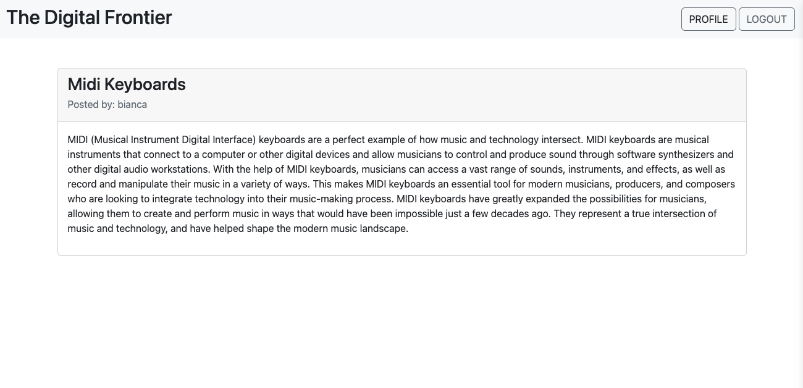
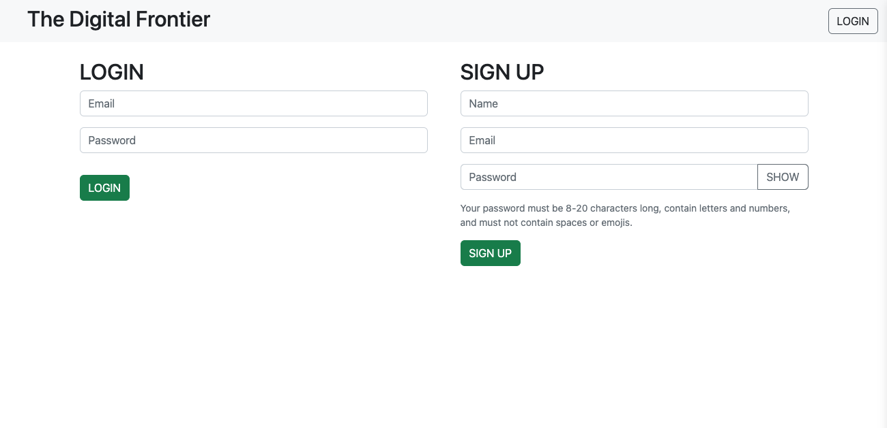
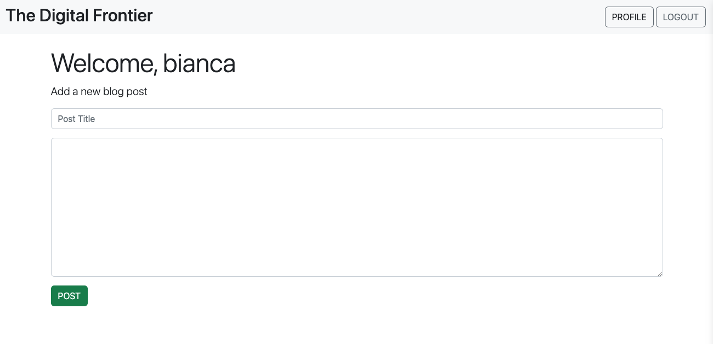
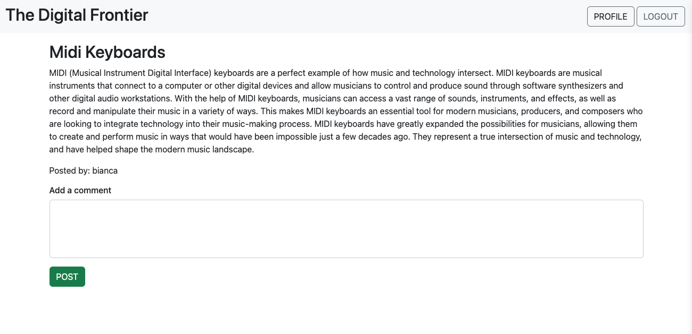

# The Digital Frontier

## Description

A blog style website to sign up, login and post content related to technology.

## Table of Contents

- [Installation](#installation)
- [Usage](#usage)
- [License](#license)
- [Contributing](#contributing)
- [Tests](#tests)
- [Questions](#questions)

## Installation

## Usage

This should be used to create posts on technology and see what other people are writing about.

Screenshots: 

 
Deployed Application: https://frozen-plains-03732.herokuapp.com/login
 
 

## License

MIT  
https://opensource.org/licenses/MIT

## Contributing

N/a

## Tests

## Questions

Contact information for any questions: 
bianca.frazier90@gmail.com 
https://github.com/b-frazier/
